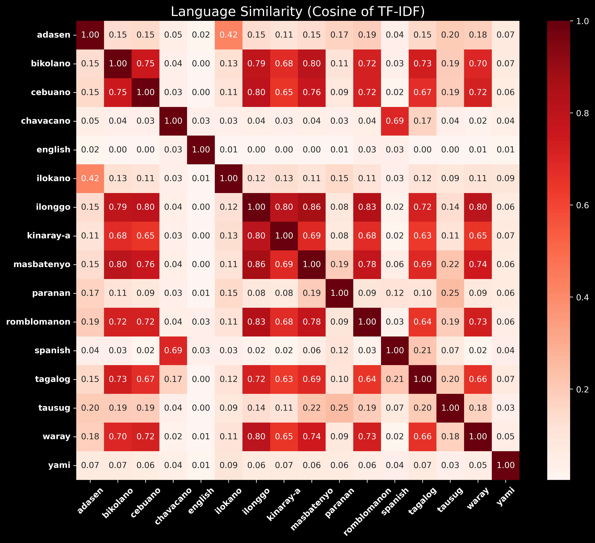
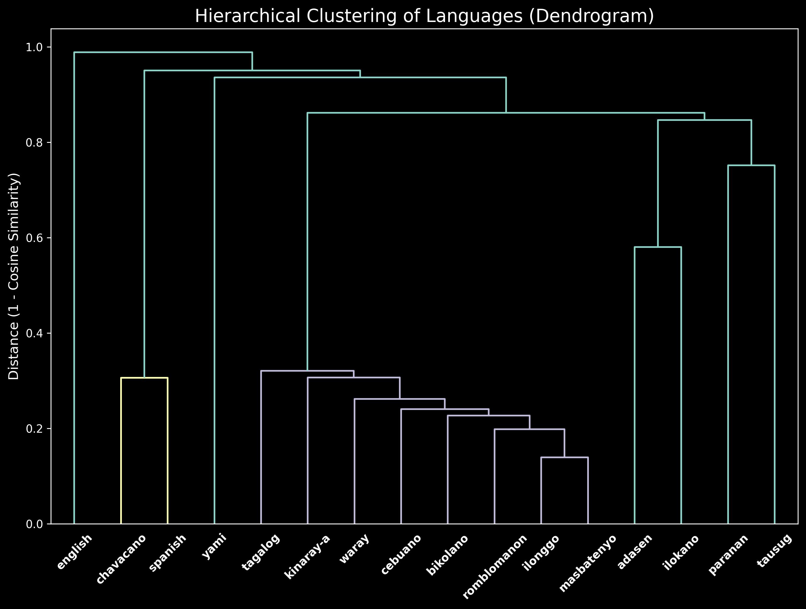

# PH Language Similarity Analysis

This project analyzes the textual similarity of 13 Philippine languages (along with English, Spanish, and Yami) using computational linguistic techniques. The goal is to quantify how similar these languages are by comparing their character-level n-gram profiles. This method captures orthographic and distributional patterns in the text.

The analysis is based on a **1.2-million-word multilingual corpus** collected from online bible texts. The similarity between languages is calculated using **3-gram** character features, weighted by **TF-IDF**, and then compared using **Cosine Similarity**.

## Final Results

### Language Similarity Heatmap

### Language Family Dendrogram

## Technologies Used
* **Python**
* **Data Collection:** Selenium, BeautifulSoup
* **Data Analysis:** Pandas, NumPy
* **NLP/ML:** scikit-learn (TF-IDF, Cosine Similarity), SciPy (Hierarchical Clustering)
* **Data Visualization:** Matplotlib, Seaborn
* **Development Environment:** Jupyter Notebook

## Data Pipeline
The project follows a 6-step data science pipeline:

1.  **Data Collection:** A custom web scraper (using Selenium and BeautifulSoup) collected a 1.2-million-word corpus from online bible texts across 16 languages.
2.  **Text Cleaning:** The raw text for each language was normalized using regex to remove all punctuation, numbers, and special characters, leaving only lowercase alphabetic characters and whitespace.
3.  **N-Gram Generation:** Each cleaned language corpus was tokenized into character 3-grams (trigrams). A master vocabulary of all unique n-grams was created (6,378 features).
4.  **Feature Engineering (TF-IDF):** A TF-IDF (Term Frequency-Inverse Document Frequency) matrix was constructed from the n-gram frequencies. This weighs each 3-gram based on its importance to a specific language versus the entire corpus.
5.  **Similarity Analysis:** Cosine Similarity was applied to the TF-IDF matrix to calculate a final 16x16 similarity score between every pair of languages.
6.  **Visualization:** The final similarity matrix was visualized as a heatmap (using Seaborn) and a dendrogram (using SciPy) to model the language family relationships.

## How to Run
The project is broken into several Jupyter notebooks that should be run in order:

1.  `scraper.ipynb`: Collects the raw text data.
2.  `cleaner.ipynb`: Cleans the raw text files.
3.  `ngrams_and_vocab.ipynb`: Generates 3-grams and the master vocabulary.
4.  `feature_engineering.ipynb`: Calculates the TF-IDF matrix.
5.  `similarity_matrix.ipynb`: Computes the final cosine similarity and generates the heatmap.
6.  `dendrogram.ipynb`: Generates the hierarchical clustering dendrogram.
